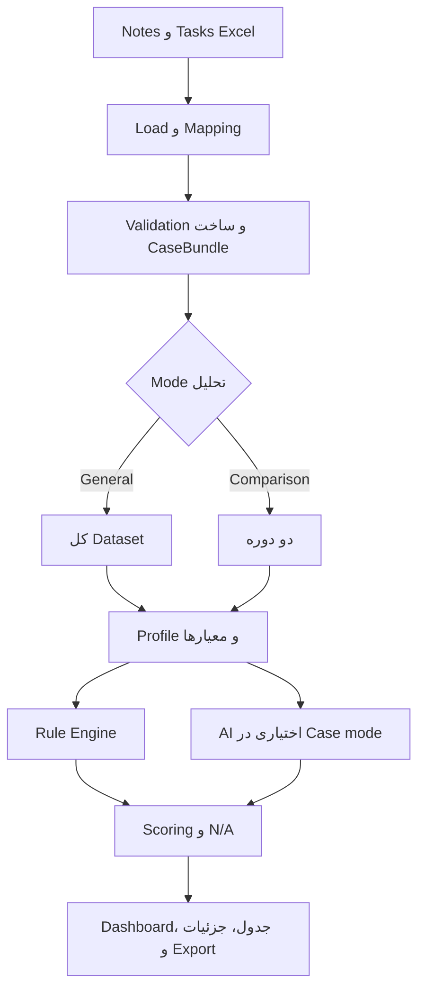

# نمای کلی سیستم

## هدف

MyBarid-AI یک برنامه Desktop برای بارگذاری داده‌های Notes و Tasks خروجی CRM،
ساخت Case، ارزیابی Rule-Based و اختیاری AI، مقایسه دوره‌ها و تولید گزارش است.

## کاربران

- کارشناس یا ارزیاب کیفیت: مشاهده جزئیات Case، Evidence و معیارها.
- مدیر: مشاهده Dashboard، رتبه‌بندی، سلامت داده و گزارش مدیریتی.
- مسئول تنظیمات: تعریف معیار، وزن، Profile، گروه کارشناسان و Provider AI.
- Developer: نگهداری Pipeline، Ruleها، Bridge و Exportها.

## قابلیت‌های اصلی

1. Upload و تشخیص خودکار ستون‌های Excel.
2. اتصال Taskها به Caseها و گزارش موارد unmatched.
3. تحلیل کلی کل Dataset.
4. مقایسه دو دوره زمانی.
5. ارزیابی Case یا Task بر اساس گروه و Profile.
6. Scoring با Coverage، Confidence و N/A.
7. تحلیل اختیاری AI برای معیارهای معنایی.
8. موارد نیازمند بررسی، سلامت داده و Export Excel/CSV.
9. تنظیمات قابل انتقال کنار EXE.

## جریان اصلی

AI جای Rule Engine را نمی‌گیرد؛ فقط برای معیارهای AI/HYBRID شواهد معنایی تولید
می‌کند و پاسخ فاقد شواهد به‌عنوان N/A ثبت می‌شود.
